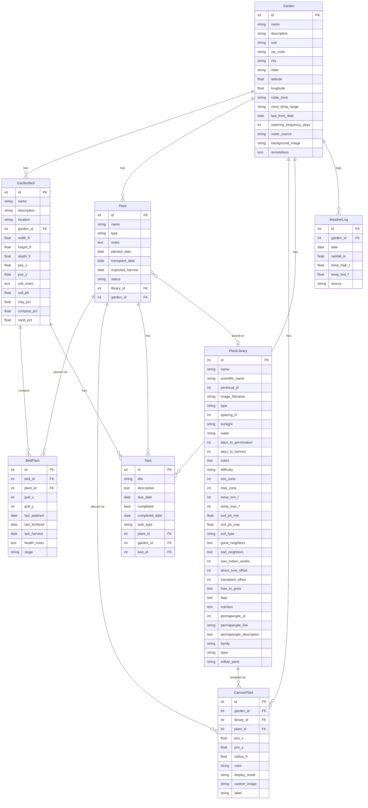

# Database Model

## ER Diagram

---

## Model Reference

### Garden
Top-level container. Each garden has a location (zip code → lat/lon, USDA zone, frost dates) used by the weather panel and planting calendar. The `annotations` field stores JSON for SVG drawing shapes on the planner canvas. `background_image` is a filename in `static/garden_backgrounds/`.

### GardenBed
A physical raised bed belonging to a garden. Positioned on the planner canvas via `pos_x`/`pos_y` (in feet). Dimensions (`width_ft`, `height_ft`) define the interactive plant grid. Soil data: free-text `soil_notes` plus structured `soil_ph`, `clay_pct`, `compost_pct`, `sand_pct`.

### Plant
A specific plant instance within a garden. Always linked to a `PlantLibrary` entry (`library_id`) for growing specs. Tracks lifecycle: `planted_date`, `transplant_date`, `expected_harvest`. `status` values: `planning`, `active`, `harvested`, `removed`.

### BedPlant *(association)*
Many-to-many link between `Plant` and `GardenBed`. Each row represents one placement of a plant inside a bed at grid coordinates (`grid_x`, `grid_y`, in inches from bed origin). Per-placement care tracking: last watered/fertilized/harvested, health notes, and growth `stage` (`seedling` → `growing` → `harvesting` → `done`).

### PlantLibrary
Shared reference catalog (~44 plants seeded). Contains growing specs (spacing, sunlight, water needs, days to germination/harvest), zone/temperature ranges, soil preferences, companion planting data (JSON arrays in `good_neighbors`/`bad_neighbors`), and how-to-grow guides (JSON). Enriched from Perenual API and Permapeople (CC BY-SA 4.0).

### CanvasPlant
A free-placed plant circle on the planner canvas — not inside any bed grid. Positioned by `pos_x`/`pos_y` (feet) with `radius_ft`. Display is either a `color` fill or an `image` (library image or custom upload in `static/canvas_plant_images/`). Optionally linked to a `Plant` instance and/or `PlantLibrary` entry.

### Task
To-do items scoped to any combination of garden, bed, and/or plant. `task_type` values: `seeding`, `transplanting`, `watering`, `fertilizing`, `weeding`, `mulching`, `harvest`, `pruning`, `other`. Tracks completion date separately from the `completed` flag.

### WeatherLog
Daily weather snapshots per garden. Unique constraint on `(garden_id, date)` prevents duplicates. `source` is `'api'` (fetched automatically) or `'manual'`. Used to calculate 7-day rainfall totals shown in the planner info panel.

---

## Key Design Notes

- **Plants are placed two ways:** inside a bed grid (`BedPlant`) or freely on the canvas (`CanvasPlant`). Both can reference the same `Plant` instance and `PlantLibrary` entry.
- **No migrations framework** — new columns are added via `ALTER TABLE` in `create_app()` on startup (`apps/api/app/main.py`).
- **PlantLibrary is shared** across all gardens. Edits to it (spacing, notes, image) affect every garden's display.
- **SQLite** database at `instance/garden.db`. Delete the file to fully reset (stops Flask first — the file is locked on Windows while running).
